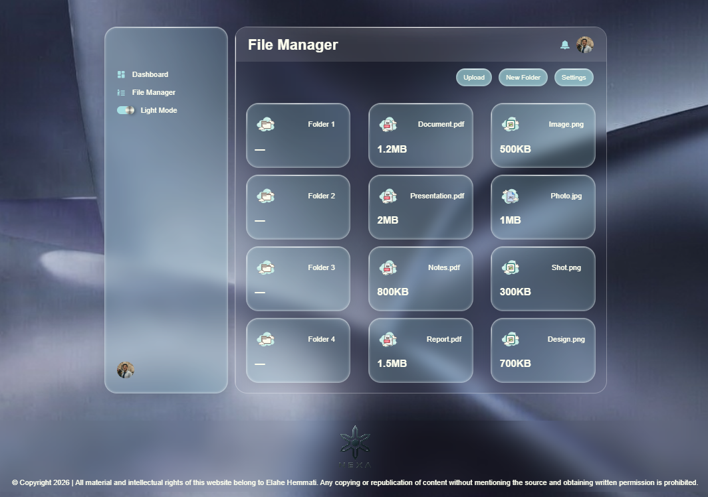
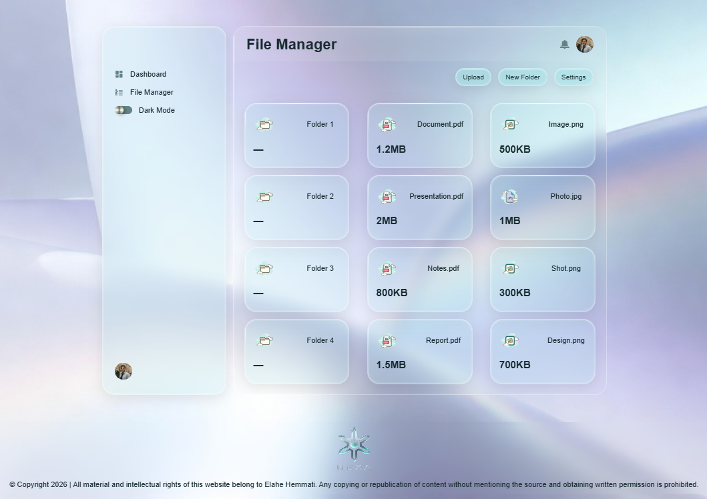
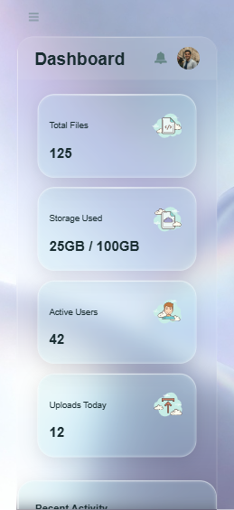
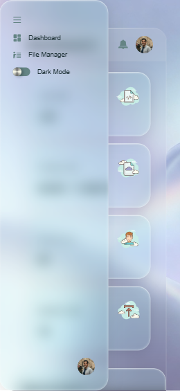

# Admin File Manager UI
> **[🔗 Live Demo / دموی زنده](https://elahe-hemmati.github.io/admin-file-manager)**
## English

A glassmorphism admin file manager UI with modular Sass architecture. This portfolio project demonstrates responsive design, advanced theming (dark/light mode), and modern front-end development practices.

### Key Features

- **Fully responsive** – Mobile, tablet, and desktop
- **Hamburger menu** – Optimized mobile UX
- **Dark/Light theme** – Toggle with persistence
- **Glassmorphism effect** – Using backdrop-filter
- **Clean Sass architecture** – Variables, mixins, nesting, partials

### Project Status

This is a pure front-end project focused on UI/UX and Sass capabilities. No data layer or API integration is currently implemented.

### Technologies

- HTML5, Sass (SCSS), JavaScript

### How to Run

```bash
git clone https://github.com/elahe-hemmati/admin-file-manager.git
cd admin-file-manager
# Then open index.html in your browser
```

### Project Structure

```
├── index.html
├── css/
├── scss/
│   ├── main.scss
│   ├── abstracts/
│   ├── pages/
│   └── layout/
├── js/
└── img/
```

### Screenshots

| Dark Mode | Light Mode |
|-----------|------------|
|  |  |

| Mobile Mode | Mobile Mode Menu |
|-------------|------------------|
|  |  |

### Contact
Elahe Hemmati – [GitHub](https://github.com/elahe-hemmati) – elahe.ali.hemmati@gmail.com

---
## فارسی

یک پنل مدیریت فایل با طراحی شیشه‌ای (Glassmorphism) و معماری ماژولار Sass. این پروژه برای نمایش مهارت‌های فرانت‌اند در زمینه طراحی ریسپانسیو، تِمینگ پیشرفته و کامپوننت‌های مدرن توسعه داده شده است.

### ویژگی‌های اصلی

- **طراحی کاملاً ریسپانسیو** – سازگار با موبایل، تبلت و دسکتاپ
- **منوی همبرگری** – تجربه کاربری بهینه در موبایل
- **تم دارک و لایت** – قابلیت تعویض با حفظ حالت انتخاب شده
- **افکت شیشه‌ای مات (Glassmorphism)** – با استفاده از backdrop-filter
- **معماری Sass تمیز** – متغیرها، mixin‌ها، nesting و فایل‌های جزئی (partials)

### وضعیت پروژه

این یک پروژه فرانت‌اند خالص است و در حال حاضر بر روی UI/UX و نمایش توانایی‌های Sass تمرکز دارد. در حال حاضر لایه دیتا یا اتصال به API پیاده‌سازی نشده است.

### تکنولوژی‌ها

- HTML5
- Sass (SCSS)
- JavaScript (منوی همبرگری + تعویض تم)

### نحوه اجرا

```bash
git clone https://github.com/elahe-hemmati/admin-file-manager.git
cd admin-file-manager
# سپس فایل index.html را در مرورگر باز کنید
```

### ساختار پروژه

```
├── index.html
├── css/
├── scss/
│   ├── main.scss
│   ├── abstracts/
│   ├── pages/
│   └── layout/
├── js/
└── img/
```

### اسکرین‌شات‌ها

| دارک مود | لایت مود |
|-----------|------------|
|  |  |

| موبایل مود | منو موبایل مود |
|-----------|-----------|
|  |  |

### ارتباط با من
الهه همتی – [GitHub](https://github.com/elahe-hemmati) – elahe.ali.hemmati@gmail.com